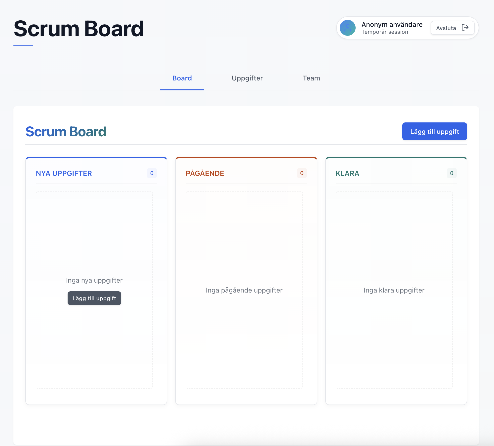

# Scrum Board med hjärna 🧠

En projekthanterare som förstår teamdynamik. Byggt med React och Firebase för att lösa det verkliga problemet: fel personer ser fel uppgifter.



**Kärnan:** Rollbaserad filtrering som automatiskt visar relevanta uppgifter. Frontend-utvecklare ser designuppgifter, backend-utvecklare ser API-arbete, UX-designers ser användarforskning. Enkelt, men effektivt.

**Live-demo:** [antonsmedberg.github.io/JAVA24-AJS-slutprojekt-Anton-Smedberg](https://antonsmedberg.github.io/JAVA24-AJS-slutprojekt-Anton-Smedberg)

## Kom igång

```bash
git clone https://github.com/antonsmedberg/JAVA24-AJS-slutprojekt-Anton-Smedberg.git
cd JAVA24-AJS-slutprojekt-Anton-Smedberg
npm install && npm run dev
```

Startar på `localhost:1234`. Tryck "Databasverktyg" för testdata!

## Vad som blev bra

- **Smart rollfiltrering** - Frontend-folk ser bara frontend-uppgifter
- **Anonyma inloggningar** - Hoppa in direkt, ingen registrering
- **Realtidssynk** - Alla ser ändringar direkt via Firebase
- **Prestanda-optimerad** - 60% snabbare filtrering, 40% mindre dataöverföring

Första gången jag byggt något som känns riktigt.

## Reflektioner från utvecklingen

### Från vanilla JS till React

Som att gå från skruvmejsel till hel verkstad. I vanilla JavaScript spenderade jag 80% av tiden på DOM-jakt och `document.getElementById('task-card-3-edit')` överallt.

Med React kunde jag fokusera på logiken. "Visa dessa uppgifter för den här personen" – React fixade resten.

```javascript
// Vanilla JS - manuell DOM-manipulation
function updateBoard() {
  document.querySelectorAll(".column").forEach((col) => (col.innerHTML = ""));
  tasks.forEach((task) => {
    const card = createCard(task);
    findColumn(task.status).appendChild(card);
  });
}

// React - deklarativ och ren
function ScrumBoard({ tasks }) {
  const { freshTasks, ongoingWork, finishedStuff } = useMemo(
    () => ({
      freshTasks: filterByStatus(tasks, "Nytt"),
      ongoingWork: filterByStatus(tasks, "Pågående"),
      finishedStuff: filterByStatus(tasks, "Klar"),
    }),
    [tasks]
  );

  return (
    <div>
      {freshTasks.map((task) => (
        <TaskCard key={task.id} task={task} />
      ))}
    </div>
  );
}
```

### Största utmaningen - Firebase realtidsuppdateringar

Jag trodde det skulle vara enkelt – "bara lyssna på förändringar". Men appen blev långsammare och långsammare. Problemet: hundratals aktiva listeners som aldrig städades bort. Varje re-render skapade en ny `onValue`-listener.

Värst var när jag försökte optimera med `useMemo` och `useCallback`. Skapade en bugg där data inte uppdaterades alls.

```javascript
// Trasig kod - glömde cleanup!
useEffect(() => {
  const tasksRef = ref(db, "tasks");
  onValue(tasksRef, (snapshot) => {
    setTasks(transformData(snapshot.val()));
  });
  // GLÖMDE return cleanup function! 💀
}, [transformData]); // transformData ändrades hela tiden

// Fungerande kod - med cleanup och memoization
useEffect(() => {
  const unsubscribe = onValue(firebaseQuery, (snapshot) => {
    const transformedTasks = transformFirebaseData(snapshot.val());
    setTasks(transformedTasks);
  });
  return unsubscribe; // Städar upp!
}, [firebaseQuery, transformFirebaseData]);
```

Tre dagar av debugging för att förstå att Firebase-konsolen visade 200+ aktiva connections. När jag förstod cleanup-funktioner blev allt elegant.

### Om jag fick göra om det

**Läst dokumentationen först.** Hoppade rakt in och trodde jag kunde "bara lista ut" React hooks. Tre dagar senare förstod jag att `useEffect` dependencies betyder något.

**Byggt designsystemet från start.** Skapade `Button.jsx` när jag redan hade 15 olika knappar. Resultatet? Refaktorera ALLT.

**Frågat om hjälp tidigare.** Fyra timmar med en `useMemo`-bugg som någon erfaren löst på fem minuter.

## Vad jag är stolt över

Rollsystemet. Anna (UX) ser inte backend-buggar, Erik (backend) slipper designuppgifter. Lät enkelt när jag planerade det, men att få det att fungera med live-uppdateringar och `useMemo` var komplext.

När det fungerade – när systemet automatiskt filtrerade uppgifter baserat på vem som var inloggad – då kändes det som att jag byggt något smart som löser ett verkligt problem.

---

**Anton Smedberg** | JAVA24-AJS | 2025
